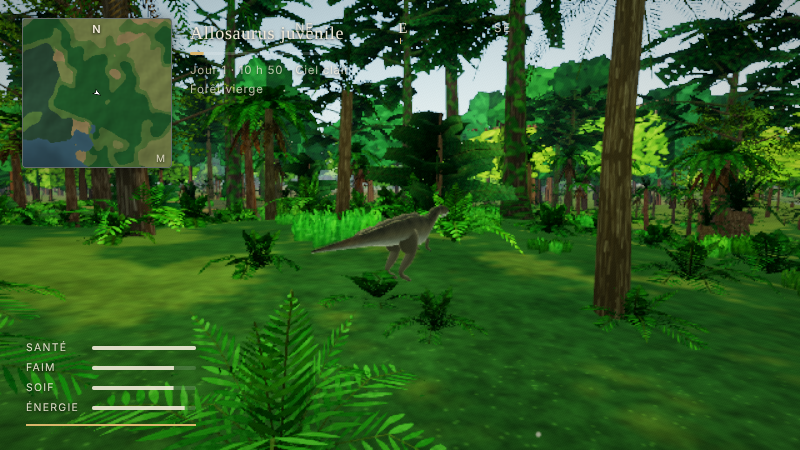
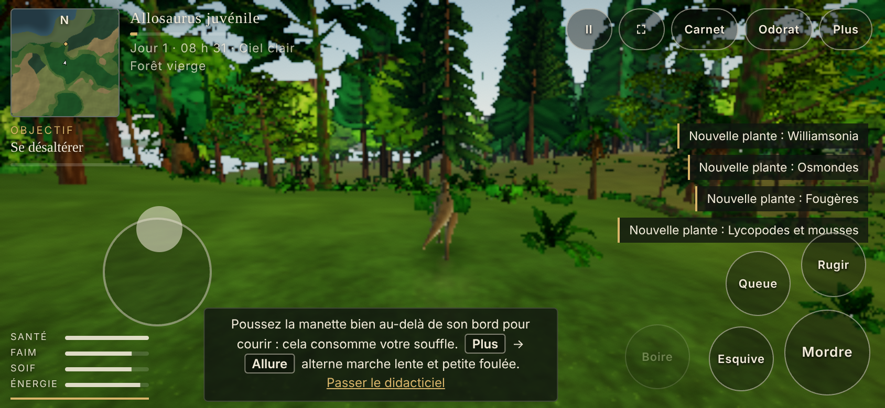
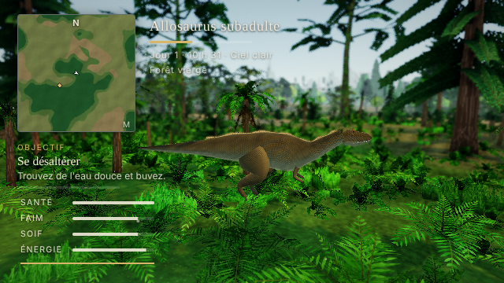
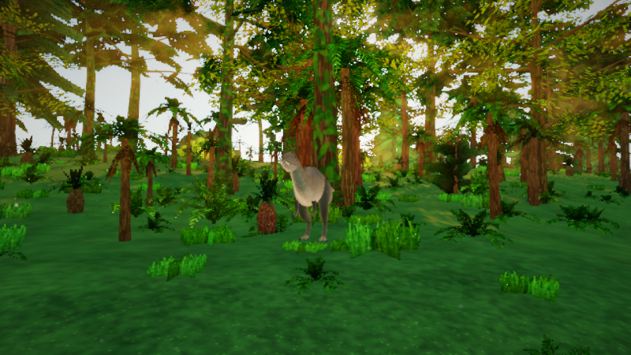

# Allosaure — Jurassique supérieur
Test --- Test
Simulation d'exploration à la troisième personne : vous incarnez un **Allosaurus**, du juvénile à l'adulte, dans un monde ouvert d'environ 4 km² il y a 150 millions d'années. Explorez, observez la faune pour remplir votre carnet scientifique, buvez, chassez, dormez, marquez votre territoire.

Tout le jeu est **procédural** : aucun fichier image, modèle 3D ou son n'est chargé. Le relief, les plantes, les dinosaures, les textures, les bruits et la musique sont calculés par le programme.




## Jouer en ligne

👉 **https://tom-markus.github.io/Entrepreneur-tycoon/**

Le site est reconstruit automatiquement à chaque modification de la branche `main` (GitHub Actions → GitHub Pages).
Si le lien affiche une erreur 404 : dans le dépôt GitHub, ouvrez **Settings → Pages** et choisissez **Source : GitHub Actions**, puis relancez le workflow dans l'onglet **Actions**.

## Jouer sur téléphone ou tablette

Ouvrez le même lien dans Chrome (Android) ou Safari (iPhone/iPad), téléphone **à l'horizontale**. Les commandes tactiles apparaissent au premier contact du doigt.



| Geste | Effet |
|---|---|
| Pouce gauche posé n'importe où à gauche | Fait apparaître la manette : se déplacer |
| Pousser la manette bien au-delà de son bord | Courir |
| Glisser le doigt sur la moitié droite | Tourner la caméra (possible en même temps que la manette) |
| Boutons en bas à droite | Mordre, Queue, Esquive, Rugir, Boire/Manger (à maintenir) |
| Boutons en haut à droite | Pause, plein écran, Carnet, Odorat, Plus |
| « Plus » | Dormir, Marquer, Nid, Photo, Ciné, Allure |
| Toucher la mini-carte | L'agrandir / la réduire |

**Plein écran** : bouton ⛶ en jeu, bouton « Plein écran » sur l'écran-titre, ou Options → Graphismes. Sur Android, le plein écran verrouille aussi l'écran en paysage. **Sur iPhone, Safari n'autorise pas le plein écran pour une page web** : utilisez Partager → « Sur l'écran d'accueil », puis lancez le jeu depuis l'icône ; il s'ouvre alors sans barre de navigation.

Tenu à la verticale, le téléphone affiche simplement « Tournez votre téléphone ».

## Jouer en local

Il faut [Node.js](https://nodejs.org) (version 18 ou plus récente). Dans un terminal, depuis le dossier du projet :

```bash
npm install
```

```bash
npm run dev
```

Ouvrez ensuite l'adresse affichée (en général `http://localhost:5173`) dans Chrome.
Pour fabriquer la version finale (dossier `dist/`) : `npm run build`.

## Contrôles

Les touches sont repérées par leur **position** sur le clavier : ZQSD sur un clavier AZERTY belge ou français, WASD sur un QWERTY. Tout se reconfigure dans **Options → Touches**.

| Action | Clavier / souris | Manette |
|---|---|---|
| Se déplacer | Z Q S D (ou flèches) | Stick gauche |
| Regarder | Souris (cliquer dans le jeu pour la capturer) | Stick droit |
| Zoom | Molette | — |
| Courir | Maj gauche | RT / clic du stick gauche |
| Marche lente ↔ petite foulée | Tab | (inclinaison du stick) |
| Esquiver | Espace | A |
| Mordre | Clic gauche | X |
| Coup de queue | Clic droit ou F | B |
| Rugir | R | Y |
| Boire / manger (maintenir) | E | RB |
| Se reposer / dormir | X | Croix bas |
| Vision olfactive | V | LB |
| Carnet de bord | J | Croix haut |
| Mode photo | P | Croix droite |
| Marquer le territoire | T | Croix gauche |
| Établir le nid | N | — |
| Caméra cinématique | C | — |
| Agrandir / réduire la mini-carte | M | — |
| Pause | Échap | Start |

**Mode photo** : clic maintenu pour regarder, touches de déplacement pour voler, Espace/C pour monter/descendre, molette pour la mise au point, Entrée pour enregistrer l'image (PNG), H pour masquer le panneau.

## Comment jouer

- **Besoins** (en bas à gauche) : santé, faim, soif, énergie. La pression est faible : la faim et la soif ne tuent jamais, elles affaiblissent seulement. Si la santé tombe à zéro, vous vous réveillez au nid.
- **Boire** : allez au bord d'une eau douce (lac, rivière, marais) et maintenez E. L'eau de mer est imbuvable.
- **Manger** : chassez de petites proies (Dryosaurus, Compsognathus), pêchez d'un coup de mâchoires en eau peu profonde, ou profitez d'une carcasse (maintenez E).
- **Vision olfactive** (V) : proies en orange, prédateurs en rouge, carcasses en vert, eau douce en bleu.
- **Carnet** (J) : gardez un animal à l'écran pour débloquer sa fiche section par section ; documentez les comportements (abreuvage, nidification, chasse…). Une photo valide la fiche d'un coup.
- **Croissance** : manger et observer fait grandir votre Allosaurus (juvénile → subadulte → adulte). Les observations donnent des points de compétence (onglet « Compétences » du carnet).
- **Territoire et nid** : T pose une marque (vous récupérez votre souffle plus vite dans votre territoire), N établit le nid (point de réveil, meilleur repos).
- **Objectifs** : un objectif à la fois s'affiche sous la mini-carte (boire, découvrir des espèces, pêcher, chasser, établir un nid…). Ils guident sans rien imposer ; la liste complète est dans le carnet, onglet « Parcours ».
- **Lieux remarquables** : neuf endroits de l'île sont à découvrir (points d'interrogation sur la grande carte).
- **Chasse** : approchez en marche lente — une proie qui ne vous a pas repéré subit le double des dégâts (attaque surprise). Mordre en pleine course déclenche une charge (bond en avant, dégâts ×1,5, souffle en moins). L'animal visé affiche son nom, son état et sa santé en haut de l'écran.
- **Mini-carte** (en haut à gauche) : elle montre les 340 m autour de vous ; M l'agrandit pour afficher toute l'île. Avec la vision olfactive active, les odeurs détectées y apparaissent en points colorés.
- **Biomes** : forêt vierge (jungle dense de podocarpes, fougères arborescentes et osmondes), forêt de ginkgos, forêt de conifères, plaine à fougères, lande à cycadales, marais, rives, plage, falaises. Ils dépendent de l'humidité et de l'altitude et forment une mosaïque sur toute l'île.
- **Sauvegarde** : automatique toutes les minutes, 3 emplacements, stockée dans le navigateur.

## Réglages de qualité

Au premier lancement, un test de 3 secondes choisit le niveau adapté à votre appareil. Vous pouvez le changer dans **Options → Graphismes**, sans redémarrer.

| Niveau | Pour quelle machine | Ce qui est activé |
|---|---|---|
| **Bas** | Chromebook, ordinateur modeste | Résolution 55 %, pas d'ombres portées (un disque sombre sous chaque animal à la place), végétation à 20 %, arbres détaillés jusqu'à 40–60 m, vue à 380 m |
| **Moyen** | Portable récent sans carte graphique dédiée | Résolution 80 %, anticrénelage ×2, ombres à 2 cascades, halo lumineux, rayons du soleil, reliefs du sol, reflets allégés, végétation à 36 %, vue à 620 m |
| **Élevé** | Ordinateur avec carte graphique | Pleine résolution, anticrénelage ×4, ombres à 3 cascades, occlusion ambiante, profondeur de champ, reflets réels, netteté renforcée, végétation à 60 %, vue à 900 m |
| **Ultra** | **PC puissant uniquement** | Tout au maximum : végétation à 100 %, arbres détaillés jusqu'à 250 m, 4 cascades d'ombres en 2048, même les fougères projettent une ombre, occlusion ambiante fine, reflets en pleine résolution, relief fin deux fois plus loin, vue à 1500 m |



**Lumière** (à partir de « Moyen ») : le ciel éclaire la scène et se reflète sur les surfaces mouillées (éclairage par l'environnement), la brume dessine de vrais faisceaux de lumière entre les troncs (brouillard volumétrique calculé à partir des cartes d'ombre), les feuilles et la peau s'illuminent à contre-jour. En « Élevé » et « Ultra » s'ajoutent des ombres de contact au pied des plantes et des animaux. La nuit est éclairée par la lune.



Le réglage **Résolution de l'image** est indépendant du niveau de qualité et propose cinq modes : « Automatique » (baisse la résolution quand le jeu passe sous 30 images/s, jusqu'à 55 %), « Automatique modérée » (pareil, mais jamais sous 80 %), « Nette » (100 % fixe), « Douce » (80 % fixe) et « Très douce » (62 % fixe). Les modes « Douce » donnent une image adoucie même sur une machine rapide. L'option « Afficher les images par seconde » montre aussi le nombre de commandes de dessin et de triangles.

## Organisation du code

Le code est en JavaScript (modules), commenté en français. Tous les réglages chiffrés sont dans **`src/config.js`**.

```
src/
  principal.js   point d'entrée : création des systèmes et boucle de jeu
  config.js      TOUS les paramètres (vitesses, masses, distances, qualité, touches…)
  noyau/         maths et bruit, entrées clavier/souris/manette, sauvegarde, qualité + benchmark
  rendu/         textures procédurales, ombres en cascade, post-traitement
  monde/         terrain et biomes, ciel, météo, eau, flore (15 types de plantes), végétation, particules, empreintes
  creatures/     espèces (données), constructeur de maillages, animation par cinématique inverse, IA, petite faune
  joueur/        Allosaurus du joueur, caméra, vision olfactive, mode photo
  science/       fiches et carnet de bord
  audio/         sons et musique synthétisés
  interface/     HUD et menus
```

Techniques utilisées : instancing et deux niveaux de détail pour la végétation, tri des plantes par cases de 64 m avec élimination hors champ, terrain découpé en morceaux chargés à la demande (4 niveaux de détail), réserves d'objets recyclés (particules, empreintes, géométries de terrain), aucune allocation dans la boucle de jeu pour les systèmes principaux, résolution dynamique.

## Ce qui a été testé

- Le jeu a été lancé et piloté automatiquement dans Chromium (Playwright) : écran-titre, nouvelle partie, déplacement, course, rugissement, morsure, esquive, vision olfactive, marquage, nid, carnet (tous les onglets), mode photo avec téléchargement du PNG, repos, caméra cinématique, pause, options, changement de qualité à chaud, sauvegarde puis « Continuer ». **Aucune erreur dans la console** aux quatre niveaux de qualité (Bas, Moyen, Élevé, Ultra).
- L'IA a tourné 7,5 minutes simulées avec événements forcés (attaques, morts, fuites, réapparitions) : aucune exception, aucune position invalide. La logique de jeu (joueur + IA + faune + carnet) coûte environ **0,25 ms par image**.
- Charge de rendu mesurée en forêt vierge (le cas le plus lourd) : Bas ≈ 65 commandes de dessin / 200 000 triangles ; Moyen ≈ 80 à 180 / 300 000 à 650 000 selon l'endroit ; Ultra ≈ 450 / 2 900 000. Élevé n'a pas été remesuré depuis le dernier réglage (il se situe entre Moyen et Ultra).
- Tournée automatique de tous les biomes, galerie de profil des sept espèces de dinosaures, et test des quatre niveaux de qualité sous l'orage et de nuit : aucune erreur.

## Limites connues

Ces points sont approximatifs ou incomplets ; ils sont listés ici plutôt que cachés.

- **« Ultra » n'a été testé qu'en rendu logiciel** : il fonctionne sans erreur, mais je n'ai pas pu mesurer sa fluidité sur un vrai PC de jeu. Près de 3 millions de triangles par image en forêt : s'il saccade, « Élevé » reste très proche visuellement.
- **Performances non vérifiées sur un vrai Chromebook.** Les tests ont été faits sur une machine **sans carte graphique** (rendu logiciel, 10 à 27 images/s en « Bas »), ce qui ne permet pas de conclure pour un Chromebook HP. La cible de 30 images/s en « Moyen » est donc un **objectif de conception, pas une mesure**. Si c'est trop lent : passez en « Bas » (le benchmark le fera de lui-même).
- **Style visuel** : les modèles sont procéduraux et donc stylisés. Les arbres sont faits de plans texturés croisés : de très près, on voit que le feuillage est plat. C'est cohérent et lisible, mais ce n'est pas du photoréalisme.
- **Arbres lointains** : au-delà de la distance de détail, chaque grand arbre devient deux panneaux croisés ; le changement peut se remarquer en avançant.
- **Eau** : une seule nappe au niveau 0 (la rivière n'a pas de pente). La réfraction est approchée par la transparence et la couleur selon la profondeur, sans déformation de l'image du fond. Les reflets réels sont complets en Élevé/Ultra, allégés en Moyen (basse résolution, une image sur trois) et absents en Bas, où l'eau reflète seulement le ciel.
- **Éclairage** : la carte d'environnement ne contient que le ciel (pas les arbres ni le relief) et n'est recalculée que lorsque le ciel change. Le brouillard volumétrique s'arrête à la portée des ombres (90 m en Moyen, 320 m en Ultra) et n'est calculé qu'au quart de la résolution. Les ombres de contact sont une approximation à l'écran. Pas de reflets à l'écran sur le sol ni d'anticrénelage temporel. Nuages « pseudo-volumétriques » (couches superposées).
- **« Bas » ne reçoit aucun de ces effets de lumière** (pas d'ombres portées, donc pas de faisceaux).
- **Animation** : cinématique inverse à deux os par patte. Sur les pentes fortes, un pied peut flotter ou s'enfoncer un peu ; la nage est rudimentaire.
- **Stades de croissance** : une même forme d'Allosaurus, modulée (taille, tête plus grosse, filaments et rayures chez le jeune, crêtes chez l'adulte).
- **Écosystème** : les animaux ne sont pas sauvegardés (ils reprennent leur domaine au chargement). Les collisions sont des cercles ; les animaux contournent le relief et l'eau, mais de façon simple. Le Brachiosaurus n'atteint pas réellement les branches qu'il broute.
- **Carnet** : pas de test d'occultation (un animal caché derrière un arbre mais dans le cadre compte comme observé). En mode photo, la validation porte sur les animaux à moins de 170 m du dinosaure.
- **Manette** : tout le jeu est jouable, mais les menus se pilotent à la souris ou au clavier.
- **Téléphone** : testé uniquement sur un téléphone simulé (écran 844 × 390, gestes tactiles envoyés au navigateur), jamais sur un vrai appareil. Les performances réelles sur téléphone sont inconnues ; le test automatique choisira le niveau de qualité. Pas de zoom à deux doigts (la distance de caméra reste fixe). En mode photo tactile, la mise au point se règle avec le curseur du panneau. Le remappage ne concerne que le clavier.
- **Audio** : entièrement synthétisé, donc simple. La voix des dinosaures est une interprétation (personne ne sait à quoi elle ressemblait).
- **Exactitude scientifique** : l'écosystème est *composite*. La plupart des espèces viennent de la formation de Morrison (Amérique du Nord) ; Compsognathus et Rhamphorhynchus vivaient à la même époque mais en Europe. Les couleurs, les filaments de l'Allosaurus juvénile et du Dryosaurus, et la vie en groupe des Compsognathus sont des hypothèses, signalées comme telles dans les fiches.
- **Petits arbres renversables** : seules les cycadales et les jeunes fougères arborescentes tombent, et seulement sous un animal d'au moins 500 kg lancé à plus de 3,5 m/s.

## Licence

Code sous licence MIT (voir `LICENSE`). Sources et licences de tout ce qui est utilisé : voir `CREDITS.md`.
